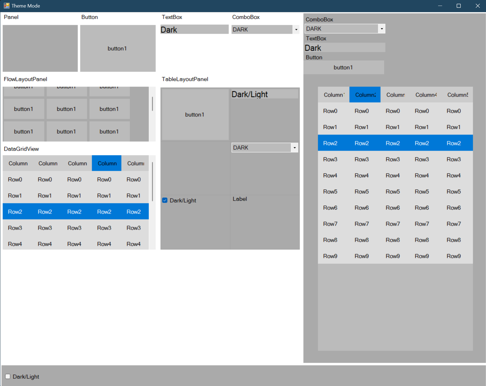

# Dark-Light-Theme

## About

A project where you can dynamically change the theme of the program. This WinForms application allows users to switch between dark and light themes seamlessly.

## Screenshot



## Features

- **Dynamic Theme Switching**: Switch between dark and light themes without restarting the application.
- **User-Friendly Interface**: Easy-to-use interface to change themes.
- **Persistent Theme Settings**: Save user preferences for themes, so the selected theme is retained on the next application start.

## Technologies Used

- **C# WinForms**: Application interface.
- **.NET Framework/Core**: Backend logic and operations.
- **JSON**: For storing theme settings.

## Installation

1. **Clone the Repository**:
    ```sh
    git clone https://github.com/BeratARPA/Dark-Light-Theme.git
    ```
2. **Open with Visual Studio**: Open the project with Visual Studio.
3. **Install Dependencies**: Restore NuGet packages.
4. **Build the Project**: Build the solution to ensure all dependencies are resolved.
5. **Run the Project**: Press F5 to run the project.

## Usage

1. **Open the Application**: Launch the application from Visual Studio or the executable.
2. **Switch Themes**: Use the provided interface to switch between dark and light themes.
3. **Save Preferences**: Your theme preference will be saved automatically.

## Contributing

If you would like to contribute, please fork the repository, create a feature branch, and submit a pull request.

## License

This project is licensed under the MIT License. See the [LICENSE](LICENSE) file for more details.

## Contact

For questions or feedback, feel free to contact me:
- **Email**: [beratarpa@hotmail.com](mailto:beratarpa@hotmail.com)
- **GitHub**: [https://github.com/BeratARPA](https://github.com/BeratARPA)
